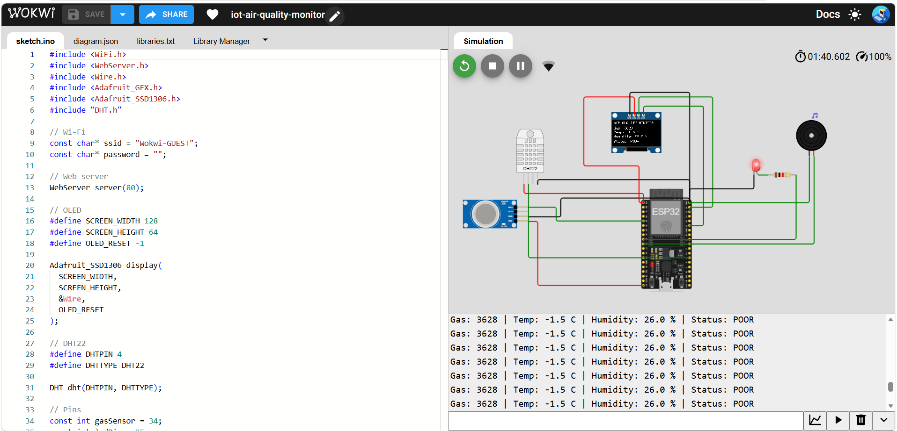
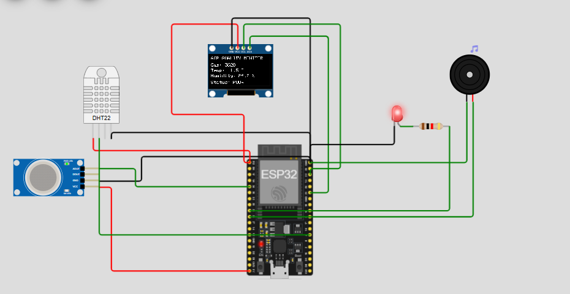

# 🌱 EcoSense – IoT-Based Air Quality Monitoring System

An **ESP32-based air quality monitoring prototype** developed as a **Microcontroller & Microprocessor Lab Mini Project**.

EcoSense monitors gas levels, temperature, and humidity and provides real-time visual and audio alerts when a high gas level is detected.

The project was designed and tested using **Wokwi simulation**.

---

## 📸 Project Demo



## 🔌 Circuit Diagram



---

## 🚀 Features

* 🌫️ Real-time gas-level monitoring
* 🌡️ Temperature monitoring
* 💧 Humidity monitoring
* 🖥️ OLED real-time display
* 🔴 LED warning indicator
* 🔊 Buzzer alert
* 📊 GOOD / MODERATE / POOR status classification
* 📡 ESP32 Wi-Fi connectivity
* 🌐 ESP32 web-server capability
* 🧪 Fully tested in Wokwi simulation

---

## 🧰 Components Used

| Component                 | Purpose                                     |
| ------------------------- | ------------------------------------------- |
| ESP32                     | Main microcontroller and Wi-Fi connectivity |
| MQ Gas Sensor             | Gas-level detection                         |
| DHT22                     | Temperature and humidity measurement        |
| 0.96" OLED                | Real-time data display                      |
| Red LED                   | Visual warning                              |
| Buzzer                    | Audio warning                               |
| 220Ω Resistor             | LED current limiting                        |
| Breadboard & Jumper Wires | Circuit connections                         |

---

## 🔌 Pin Connections

| Component    | ESP32 Pin |
| ------------ | --------- |
| MQ Sensor AO | GPIO 34   |
| DHT22 DATA   | GPIO 4    |
| Red LED      | GPIO 25   |
| Buzzer       | GPIO 26   |
| OLED SDA     | GPIO 21   |
| OLED SCL     | GPIO 22   |
| OLED VCC     | 3.3V      |
| OLED GND     | GND       |

---

## ⚙️ Working Principle

The **MQ gas sensor** provides an analog output to the ESP32. The ESP32 reads the sensor's ADC value and classifies the detected gas level into three project-defined conditions:

* 🟢 **GOOD**
* 🟠 **MODERATE**
* 🔴 **POOR**

The **DHT22** measures temperature and humidity.

The sensor readings are displayed on the **OLED display**. When the gas level crosses the defined alert threshold, the ESP32 activates the **LED and buzzer**.

The ESP32 also connects to Wi-Fi and runs a web-server interface for future remote monitoring.

### System Architecture

```text
             ┌─────────────────┐
             │  MQ Gas Sensor  │
             └────────┬────────┘
                      │
             ┌────────▼────────┐
             │                 │
             │      ESP32      │
             │  Microcontroller│
             │                 │
             └──┬────┬────┬────┘
                │    │    │
                │    │    └──────────┐
                │    │               │
                ▼    ▼               ▼
             OLED   LED            Buzzer
                │
                │
             Wi-Fi
                │
                ▼
          Web Server / IoT
             Monitoring

        DHT22 ───────► ESP32
```

---

## 📊 Air Quality Classification

The current prototype uses the following **demonstration thresholds** based on the ESP32 ADC reading:

| ADC Reading | Status      | LED | Buzzer |
| ----------: | ----------- | --- | ------ |
|      0–1499 | 🟢 GOOD     | OFF | OFF    |
|   1500–2799 | 🟠 MODERATE | OFF | OFF    |
|   2800–4095 | 🔴 POOR     | ON  | ON     |

> **Important:** These thresholds are for this prototype demonstration. They are not official AQI limits.

---

## 🧪 Testing

The system was tested under different simulated gas-level conditions.

| Test               | Gas ADC | Expected Result |
| ------------------ | ------: | --------------- |
| Good condition     |   ~1000 | GOOD            |
| Moderate condition |   ~2200 | MODERATE        |
| High gas condition |   ~3500 | POOR + Alert    |

The DHT22 temperature and humidity readings were also monitored through the OLED and Serial Monitor.

---

## 📡 Wi-Fi & Web Server

The ESP32 connects to the Wokwi Wi-Fi network and starts a local web server.

The web interface is designed to display:

* Gas level
* Temperature
* Humidity
* Air-quality status
* Alert condition

The web-server functionality is currently demonstrated within the ESP32/Wokwi environment.

---

## 🧪 PPM Note

The Wokwi MQ2 component provides a simulated **GAS (PPM)** control.

However, the ESP32 code currently reads the sensor's **analog output (ADC)** rather than directly receiving the Wokwi PPM slider value.

Therefore, the project does **not** claim that the ADC value is a direct PPM measurement.

Accurate real-world PPM measurement would require sensor-specific calibration and a suitable gas-concentration conversion model.

---

## 💻 Technologies Used

* **ESP32**
* **Embedded C/C++**
* **Arduino Framework**
* **Wokwi**
* **MQ Gas Sensor**
* **DHT22**
* **SSD1306 OLED**
* **Wi-Fi**
* **Web Server**

---

## 📁 Project Structure

```text
EcoSense-Air-Quality-Monitor/
│
├── README.md
│
├── src/
│   └── sketch.ino
│
├── docs/
│   └── project-image.png
│
└── wokwi/
    ├── diagram.json
    └── libraries.txt
```

---

## 🔮 Future Improvements

* 📱 Mobile-accessible dashboard
* 📈 Historical sensor-data graphs
* ☁️ Cloud data logging
* 🔔 Remote notifications
* 🔬 Real sensor calibration for PPM measurement
* 🔋 Battery-powered portable version
* 📍 Location-based air-quality monitoring
* 🏠 Integration with smart-home systems

---

## 🎓 Academic Project

**Project:** EcoSense – IoT-Based Air Quality Monitoring System
**Type:** Microcontroller & Microprocessor Lab Mini Project
**Domain:** Embedded Systems & IoT
**Platform:** Wokwi
**Microcontroller:** ESP32

---

## 👨‍💻 Author

**Karthikeyan**

ECE Student | Embedded Systems | IoT | Electronics

---

⭐ If you find this project useful, consider giving the repository a star!
